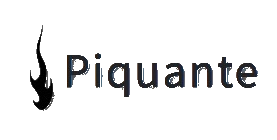

# SoPekocko

## *API Documentation*
Find the API documentation at this address: 
**https://lulubaroy.github.io/So_Pekocko_Documentation/**

## *Environment*
This API has been developed with [NodeJS](https://nodejs.org/en/), [Express](https://www.npmjs.com/package/express) v4.17.1 and [MongoDB](https://www.mongodb.com/cloud/atlas)

## *Prerequisites*
You will need to have :
- Node 
- `npm` 
- Atlas MongoDB account

## *Installation*
Clone this repository.

- Run `npm install` 
- Create a directory named `images` in project root
- Get the `.env.sample` file and rename it as `.env` 
- Fill in the different fields using your own MongoDB account information and choose a Private Key for the JWToken
- Run `node server`, the server should 
run on `localhost` with default port `3000` and you should read `Listening on port 3000` and `Connexion à MongoDB réussie` in the console

( / ! \ If you want to use the route `export` in `controllers/users.js`, please create a directory named `files` in project root)

## *Author*
Lucie BAROILLER
